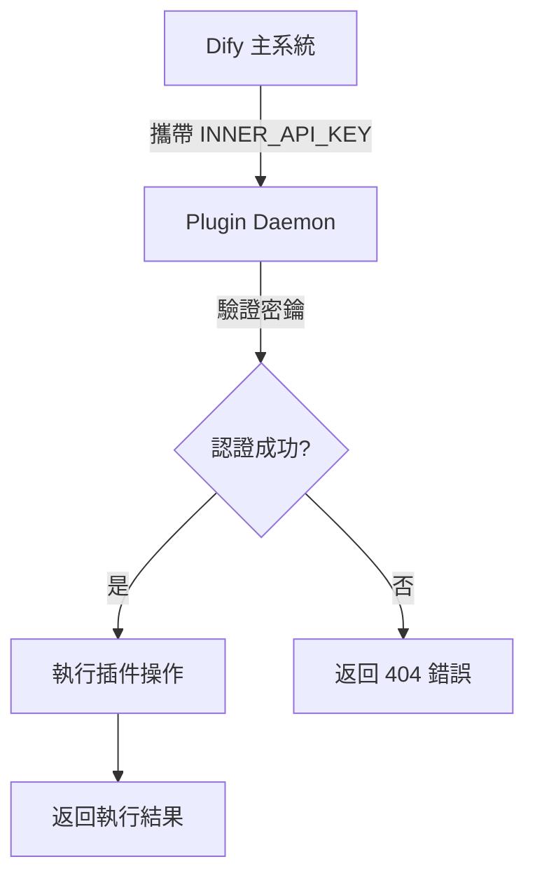

## 前言

在使用 Dify 平台的 LLM 代理功能時，許多開發者可能會遇到一個令人困惑的 404 錯誤。本文將詳細說明這個問題的成因、解決方法，以及 `INNER_API_KEY_FOR_PLUGIN` 環境變數的重要作用。

## 問題現象

當在 Dify 中使用 LLM 代理功能時，系統會出現以下錯誤訊息：

```bash
Run failed: Failed to transform agent message: PluginInvokeError: {
  "args": {},
  "error_type": "Exception",
  "message": "invoke llm model failed: request failed with status code: 404 and respond with: {\"code\": \"not_found\", \"message\": \"The requested URL was not found on the server. If you entered the URL manually please check your spelling and try again.\", \"status\": 404}\n"
}
```

## 錯誤分析

### 根本原因

這個錯誤的核心問題在於 **Dify 系統內部組件與插件守護進程（Plugin Daemon）之間的通訊認證失敗**。具體來說：

1. **缺失內部 API 密鑰**：Dify 主系統嘗試與 Plugin Daemon 進行通訊時，缺少必要的內部認證密鑰
2. **通訊授權失敗**：Plugin Daemon 無法驗證來自主系統的請求合法性
3. **API 端點無法找到**：由於認證失敗，相關的 API 端點無法正確建立連接

### 為什麼會出現這個問題？

- **不完整的部署配置**：在 Docker 部署或手動安裝時，可能遺漏了關鍵的環境變數設定
- **版本更新後的配置遺失**：升級 Dify 版本後，新的內部認證機制需要額外的配置
- **插件系統的架構變更**：隨著 Dify 插件系統的完善，內部通訊安全性要求提高

## 解決方案

### 步驟 1：定位配置檔案

根據你的 Dify 部署方式，找到對應的配置檔案：

**Docker 部署**：
- 主要檔案：`docker-compose.yaml`
- 環境檔案：`.env`

**手動部署**：
- API 服務環境檔案：`api/.env`

### 步驟 2：添加 INNER_API_KEY_FOR_PLUGIN

在 `.env` 檔案中加入以下設定：

```bash
INNER_API_KEY_FOR_PLUGIN=QaHbTe77CtuXmsfyhR7+vRjI/+XbV1AaFy691iy+kGDv2Jvy0/eAh8Y1
```

:::warning[重要提醒]
上述密鑰僅為範例，實際部署時建議生成自己的安全密鑰。
:::

### 步驟 3：重啟服務

完成設定後，重啟 Dify 服務：

**Docker 部署**：
```bash
docker-compose down
docker-compose up -d
```

**手動部署**：
```bash
# 重啟 API 服務和 Plugin Daemon
systemctl restart dify-api
systemctl restart dify-plugin-daemon
```

## INNER_API_KEY_FOR_PLUGIN 詳解

### 什麼是 INNER_API_KEY_FOR_PLUGIN？

`INNER_API_KEY_FOR_PLUGIN` 是 Dify 系統中專門用於**內部組件與插件守護進程通訊**的 API 密鑰。它的主要功能包括：

#### 1. 內部認證與授權
- 確保只有授權的內部服務可以進行敏感操作
- 防止未授權的外部存取
- 維護系統內部通訊的安全性

#### 2. 插件管理功能
- 插件安裝、卸載、更新過程中的身份驗證
- Plugin Daemon 與主系統間的資料交換
- 插件功能調用時的授權檢查

#### 3. 系統級安全設計
- 屬於系統級敏感資訊，不應暴露給外部用戶
- 僅限於 Dify 內部組件（API 服務、Plugin Daemon 等）使用
- 確保插件相關操作的完整性與安全性

### 技術實現原理

在 Dify 的架構中，`INNER_API_KEY_FOR_PLUGIN` 的工作流程如下：



### 配置範例

#### Docker Compose 配置
```yaml
services:
  plugin_daemon:
    environment:
      DIFY_INNER_API_KEY: ${INNER_API_KEY_FOR_PLUGIN:-QaHbTe77CtuXmsfyhR7+vRjI/+XbV1AaFy691iy+kGDv2Jvy0/eAh8Y1}
```

#### 環境變數檔案
```bash
# .env 檔案
INNER_API_KEY_FOR_PLUGIN=QaHbTe77CtuXmsfyhR7+vRjI/+XbV1AaFy691iy+kGDv2Jvy0/eAh8Y1
```

## 安全性考量

### 密鑰管理最佳實踐

1. **使用強密鑰**
   ```bash
   # 生成安全的隨機密鑰
   openssl rand -base64 48
   ```

2. **定期更新**
   - 建議每季度更新一次內部 API 密鑰
   - 更新時需同步修改所有相關組件的配置

3. **存取控制**
   - 限制能夠存取配置檔案的用戶權限
   - 使用環境變數而非硬編碼方式儲存密鑰

### 常見安全風險

❌ **避免的做法**：
- 將密鑰直接寫在程式碼中
- 在日誌檔案中記錄密鑰資訊
- 使用過於簡單的密鑰值

✅ **推薦的做法**：
- 使用環境變數管理敏感資訊
- 實施適當的文件權限控制
- 定期審查和更新安全配置

## 故障排除指南

### 1. 確認設定是否生效

檢查環境變數是否正確載入：

```bash
# 在容器內檢查環境變數
docker exec -it dify-api env | grep INNER_API_KEY_FOR_PLUGIN
```

### 2. 檢查日誌輸出

查看相關服務的日誌：

```bash
# 查看 API 服務日誌
docker logs dify-api

# 查看 Plugin Daemon 日誌
docker logs dify-plugin-daemon
```

### 3. 驗證網路連接

確認各組件間的網路連通性：

```bash
# 測試組件間連接
docker exec -it dify-api ping plugin-daemon
```

### 4. 重置配置

如果問題持續存在，可以嘗試重置相關配置：

```bash
# 停止所有服務
docker-compose down

# 清理相關資料（謹慎操作）
docker volume prune

# 重新啟動
docker-compose up -d
```

## 其他相關問題

### 插件安裝失敗

如果在插件安裝過程中也遇到類似錯誤，同樣的解決方案適用：

1. 確認 `INNER_API_KEY_FOR_PLUGIN` 已正確設定
2. 檢查 Plugin Daemon 服務狀態
3. 驗證網路連接和防火牆設定

### 版本相容性

不同版本的 Dify 可能對 `INNER_API_KEY_FOR_PLUGIN` 有不同要求：

- **1.0.0 及以後版本**：必須設定此環境變數
- **早期版本**：可能不需要或使用不同的認證機制

### 多節點部署注意事項

在多節點部署環境中：

1. **統一密鑰**：所有節點必須使用相同的 `INNER_API_KEY_FOR_PLUGIN`
2. **同步更新**：更新密鑰時需要同時更新所有節點
3. **負載均衡**：確保負載均衡器不會影響內部 API 通訊

## 總結

`INNER_API_KEY_FOR_PLUGIN` 是 Dify 插件系統安全架構的重要組成部分。正確設定這個環境變數不僅能解決 LLM 代理功能的 404 錯誤，還能確保整個插件生態系統的穩定運行。

### 關鍵要點回顧

1. **問題根源**：內部組件通訊認證失敗
2. **解決方案**：在 `.env` 檔案中正確設定 `INNER_API_KEY_FOR_PLUGIN`
3. **安全考量**：使用強密鑰並定期更新
4. **維護建議**：定期檢查日誌和服務狀態

透過本文的說明，相信你已經能夠成功解決 Dify LLM 代理功能的相關問題，並對 Dify 的插件系統有了更深入的理解。

---

> 參考資料：
> 
> [Dify 官方文件：Plugin Development](https://docs.dify.ai/plugin-dev-en/0211-getting-started-dify-tool)
> 
> [Dify GitHub Repository](https://github.com/langgenius/dify)
> 
> [Dify 插件開發指南](https://docs.dify.ai/en/plugins/quick-start/develop-plugins) 