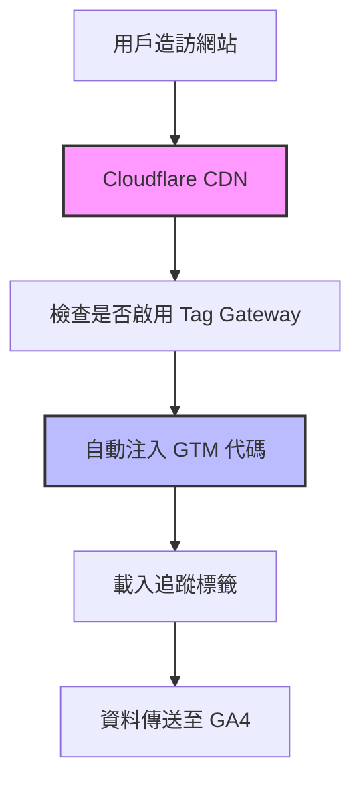
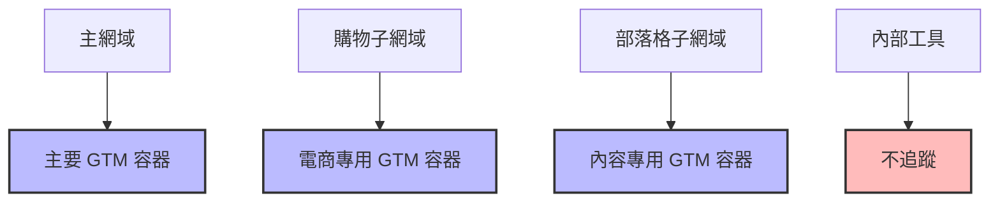

## 前言

最近在檢查網站追蹤數據時，發現了一個令人困惑的現象：明明子網域沒有安裝 Google Tag Manager (GTM)，但在 GA4 報表中卻看到這些子網域的訪問數據。經過一番調查後，才發現問題的根源是我之前啟用的 **Google Tag Gateway** 功能與 Cloudflare 的整合。

這個發現讓我重新思考了 Google Tag Gateway 的運作機制，也意識到這個功能對網站追蹤的影響比想像中更深遠。本文將詳細說明這個狀況的成因、影響，以及可能的解決方案。

## 什麼是 Google Tag Gateway？

Google Tag Gateway（Google 代碼閘道）是 Google 推出的一項服務，旨在提升網站追蹤的準確性和可靠性。透過這項服務，您可以：

### 核心功能

1. **第一方追蹤**：將 Google 標籤透過您自己的網域提供，而非從 Google 的伺服器載入
2. **繞過廣告攔截器**：減少被廣告攔截軟體阻擋的機率
3. **改善資料收集**：提高追蹤碼的載入成功率
4. **增強隱私控制**：透過自己的 CDN 管理追蹤資料流

### 技術原理

Google Tag Gateway 的運作原理如下：



## 我遇到的狀況分析

### 問題現象

1. **子網域未安裝 GTM**：確認子網域的 HTML 原始碼中沒有 GTM 追蹤代碼
2. **GA4 卻有子網域數據**：在 GA4 報表中發現子網域的訪問記錄
3. **跨網域追蹤生效**：子網域的使用者旅程被正確追蹤

### 根本原因

啟用 Google Tag Gateway 後，**Cloudflare 會在 CDN 層級自動注入 GTM 代碼**，這意味著：

#### 1. CDN 層級的代碼注入

```javascript
// Cloudflare 在 CDN 層級自動注入的代碼
(function(w,d,s,l,i){
    w[l]=w[l]||[];
    w[l].push({'gtm.start': new Date().getTime(),event:'gtm.js'});
    var f=d.getElementsByTagName(s)[0],
    j=d.createElement(s),dl=l!='dataLayer'?'&l='+l:'';
    j.async=true;
    j.src='https://your-domain.com/gtm-gateway/gtm.js?id='+i+dl;
    f.parentNode.insertBefore(j,f);
})(window,document,'script','dataLayer','GTM-XXXXXXX');
```

#### 2. 網域層級的影響

當您設定 Google Tag Gateway 指向主網域時：
- **主網域**：`example.com` ✓ 追蹤生效
- **子網域**：`blog.example.com` ✓ 自動被包含
- **子網域**：`shop.example.com` ✓ 自動被包含

#### 3. 免費版本的限制

Cloudflare 免費版本的 Google Tag Gateway 設定中：
- 無法精細控制特定子網域的包含/排除
- 預設會對整個網域（包含所有子網域）生效
- 只能在付費版本中設定更細緻的網域規則

## 為什麼會發生這種情況？

### 1. Cloudflare 的 CDN 注入機制

```bash
# 當用戶訪問任何子網域時，Cloudflare 會：
1. 檢查該請求是否來自已啟用 Tag Gateway 的網域
2. 自動在 HTML 回應中注入 GTM 代碼
3. 將追蹤資料透過您的網域傳送
```

### 2. 網域配置的繼承性

```yaml
# Google Tag Gateway 配置
domain: example.com
includes:
  - "*.example.com"  # 預設包含所有子網域
  - "example.com"
tracking_code: GTM-XXXXXXX
```

### 3. 第一方 Cookie 的共享

由於所有子網域都屬於同一個主網域，GTM 設定的第一方 Cookie 會在所有子網域間共享，實現無縫的跨網域追蹤。

## 實際影響分析

### 正面影響

1. **完整的使用者旅程追蹤**
   - 使用者從主網域到子網域的完整行為路徑
   - 更準確的轉換歸因分析

2. **提升追蹤可靠性**
   - 減少被廣告攔截器阻擋的機率
   - 提高資料收集的完整性

3. **簡化管理複雜度**
   - 不需要在每個子網域手動安裝 GTM
   - 統一的追蹤標籤管理

### 潛在問題

1. **意外的資料收集**
   - 可能收集到原本不打算追蹤的子網域資料
   - 違反某些隱私政策或用戶預期

2. **資料污染風險**
   - 測試環境或內部工具的資料混入
   - 影響分析結果的準確性

3. **合規性考量**
   - 某些地區的隱私法規要求明確同意
   - 需要確保所有子網域都有適當的隱私聲明

## 解決方案與建議

### 1. 立即性解決方案

#### 檢查當前配置

```bash
# 檢查 Cloudflare 中的 Tag Gateway 設定
1. 登入 Cloudflare Dashboard
2. 進入 "Tag Management" > "Google tag gateway"
3. 查看已啟用的網域清單
```

#### 暫時停用特定子網域

```javascript
// 在不想追蹤的子網域加入排除代碼
if (window.location.hostname.includes('internal.example.com')) {
    window['ga-disable-GTM-XXXXXXX'] = true;
}
```

### 2. 長期解決方案

#### 升級到付費版本

```yaml
# Cloudflare Pro 版本可以設定：
included_domains:
  - "example.com"
  - "www.example.com"
  - "shop.example.com"
excluded_domains:
  - "internal.example.com"
  - "test.example.com"
```

#### 重新設計追蹤架構



### 3. 資料清理建議

#### 設定 GA4 篩選器

```javascript
// 在 GA4 中排除特定子網域
配置 > 資料串流 > 網站 > 標記設定 > 設定標記設定
添加條件：
- 排除推薦連結來源：internal.example.com
- 排除主機名稱：test.example.com
```

#### 建立自訂維度

```javascript
// 透過 GTM 設定自訂維度區分不同網域
gtag('config', 'GA4_MEASUREMENT_ID', {
    'custom_map': {
        'custom_parameter_1': 'domain_type'
    }
});

// 根據主機名稱設定不同值
var domainType = 'main';
if (window.location.hostname.includes('shop.')) {
    domainType = 'ecommerce';
} else if (window.location.hostname.includes('blog.')) {
    domainType = 'content';
}
```

## 最佳實踐建議

### 1. 規劃階段

1. **明確追蹤需求**
   - 列出所有需要追蹤的網域
   - 定義每個網域的追蹤目標

2. **評估隱私影響**
   - 確保所有被追蹤的網域都有適當的隱私聲明
   - 考慮用戶同意機制

3. **測試環境隔離**
   - 將測試環境放在不同的網域
   - 或使用不同的 GTM 容器

### 2. 實施階段

1. **分階段部署**
   - 先在主網域測試 Tag Gateway
   - 確認運作正常後再擴展到子網域

2. **監控資料品質**
   - 定期檢查 GA4 報表中的異常流量
   - 設定資料品質監控警報

3. **文檔化配置**
   - 記錄所有 Tag Gateway 設定
   - 維護網域追蹤清單

### 3. 維護階段

1. **定期檢查**
   - 每月檢查 Cloudflare Tag Gateway 設定
   - 確認沒有新的子網域被意外包含

2. **效能監控**
   - 監控網站載入速度
   - 確認 Tag Gateway 不影響使用者體驗

3. **法規遵循**
   - 定期檢查隱私政策更新
   - 確保追蹤設定符合最新法規要求

## 結論

Google Tag Gateway 與 Cloudflare 的整合確實是一個強大的追蹤工具，但它的運作方式可能會超出我們的預期。**在 CDN 層級自動注入 GTM 代碼** 的機制，讓所有子網域都被自動包含在追蹤範圍內，這既是優勢也是挑戰。

### 關鍵要點

1. **Google Tag Gateway 會在 CDN 層級自動注入追蹤代碼**
2. **免費版本無法精細控制特定子網域的包含/排除**
3. **需要主動管理和監控追蹤範圍**
4. **建議升級到付費版本以獲得更多控制權**

### 行動建議

如果您也遇到類似的情況，建議：
1. 立即檢查 Cloudflare 中的 Tag Gateway 設定
2. 評估是否需要排除某些子網域
3. 考慮升級到付費版本以獲得更精細的控制
4. 重新檢視隱私政策和用戶同意機制

記住，**資料收集的透明度和用戶隱私保護永遠是最重要的考量**。在享受 Tag Gateway 帶來的便利時，也要確保我們的追蹤行為符合法規要求和用戶預期。

---

> **參考資料：**
> - [Google Tag Gateway 官方說明](https://support.google.com/tagmanager/answer/16061406)
> - [Cloudflare Google Tag Gateway 文檔](https://developers.cloudflare.com/google-tag-gateway/)
> - [GA4 跨網域追蹤升級：Google Tag Gateway 完整指南](https://ga4.cc/2579/upgrade-to-google-tag-gateway/)
> - [Loves Data: Google Tag Gateway Setup Guide](https://www.lovesdata.com/blog/google-tag-gateway/)

---

**延伸閱讀：**
- [GA4 跨網域追蹤討論：什麼情境下才需要？](./ga4-cross-domain-tracking-guide)
- [第一方追蹤 vs 第三方追蹤：完整比較分析](./first-party-vs-third-party-tracking) 